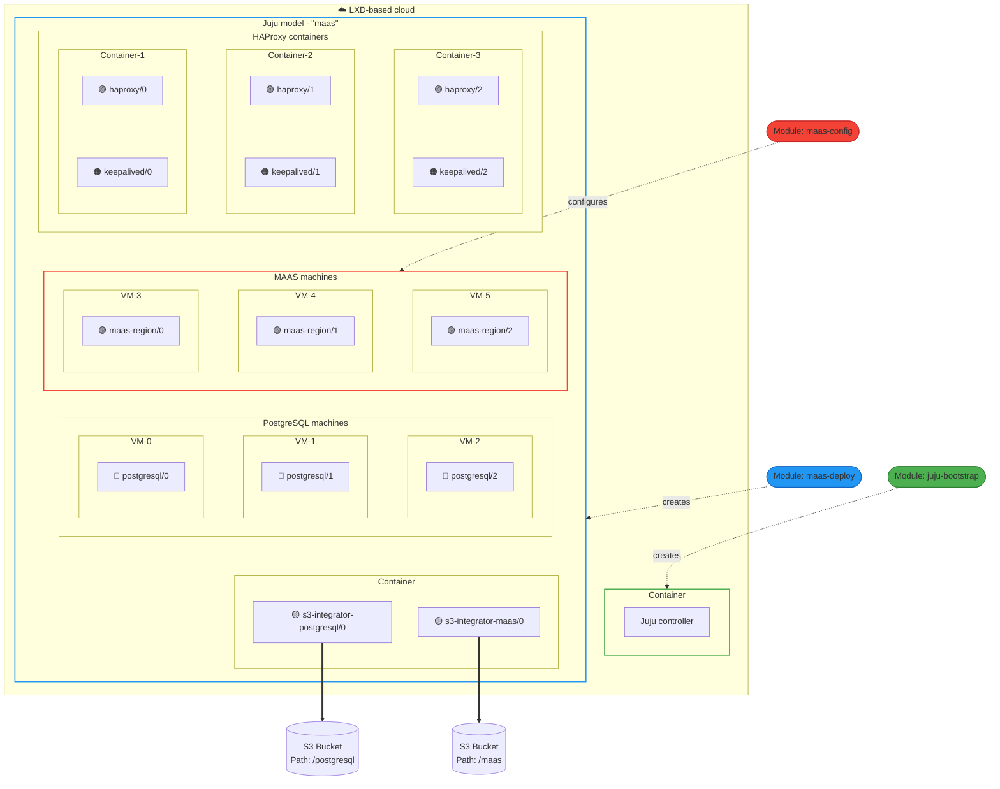

# Terraform driven Charmed MAAS deployment

This repository is a collection of Terraform modules, Terragrunt units and Terragrunt stacks that automate the deployment and configuration of high availability (HA) [Charmed](https://juju.is/docs) [MAAS](https://canonical.com/maas/docs). Using the provided Terragrunt stacks, you can go from a bare machine cloud to a deployed and configured MAAS cluster with just a few commands.

The key modules contained in this catalog are:

- [Juju Bootstrap](./modules/juju-bootstrap) - Bootstraps Juju on a provided LXD server or cluster; optional if you already have an external Juju controller.
- [MAAS Deploy](./modules/maas-deploy) - Deploys charmed MAAS
- [MAAS Config](./modules/maas-config) - Initially configures charmed MAAS

The deployment of these modules is driven by Terragrunt stacks.

> [!NOTE]
> The `juju-bootstrap` module and its respective unit are LXD cloud specific, and this catalog is tested with a LXD cloud. However, for the other modules and units, any machine cloud is a valid deployment target, but manual clouds are unsupported. To read more about Juju supported clouds, please see the [Juju documentation](https://documentation.ubuntu.com/juju/3.6/reference/cloud/list-of-supported-clouds/).

> [!NOTE]
> The content of this repository is in an early release phase. We recommend testing in a non-production environment first to verify they meet your specific requirements before deploying in production.

## Contents

- [Terraform driven Charmed MAAS deployment](#terraform-driven-charmed-maas-deployment)
  - [Contents](#contents)
  - [Getting started](#getting-started)
  - [Prerequisites](#prerequisites)
  - [How to use this repository](#how-to-use-this-repository)
    - [Repository structure](#repository-structure)
  - [Architecture](#architecture)
      - [MAAS Regions](#maas-regions)
      - [PostgreSQL](#postgresql)
      - [HAProxy and Keepalived](#haproxy-and-keepalived)
      - [Juju Controller](#juju-controller)
      - [Cloud](#cloud)
  - [Appendix - Backup and Restore](#appendix---backup-and-restore)

## Getting started

If you just want to deploy Charmed MAAS:

1. Review the [Prerequisites](#prerequisites) section.
1. Follow the [LXD configuration guide](./docs/how_to_configure_lxd_for_juju_bootstrap.md) to get your required inputs to the stacks.
1. Explore the [example stacks](./examples/stacks/) to deploy your first MAAS cluster.

## Prerequisites

To run the stacks and units in this repository, the following software must be installed in the local system:

- OpenTofu/Terraform
- Terragrunt
- A LXD cloud that is initialized and configured (see [How to configure LXD for Juju bootstrap](./docs/how_to_configure_lxd_for_juju_bootstrap.md))

It is recommended to create a jumphost/bastion LXD container on the LXD cluster/server, install the pre-requisites, and run the relevant stacks or units from there.

## How to use this repository

This repository provides Terraform modules for you to consume and deploy your own infrastructure. These modules can be consumed in several ways:

- Using Terragrunt stacks - This is the recommended way to consume the modules in this repository. Terragrunt stacks simplify the deployment of the modules by handling the dependencies between them, allowing you to deploy all modules together with just a few commands. See the [examples/stacks](./examples/stacks/README.md) directory to get started.
- Using Terragrunt units - Terragrunt units are thin wrappers around Terraform modules that allow you to run individual modules with Terragrunt. You can either use the provided units in the [examples/units](./examples/units/README.md) directory, or explore the catalog with `terragrunt catalog <repo-url>` and scaffold your own.

Typically, you should create your own repository (e.g. `infrastructure-live`) to hold your Terragrunt stack and unit files that are specific to your deployments. When you do this, you will need to pin units and modules to specific tags or commit SHAs using the `source` argument to make your file an immutable definition of your infrastructure. To read more about this, please see the [Terragrunt documentation](https://terragrunt.gruntwork.io/docs/getting-started/) and their [example infrastructure-live repository](https://github.com/gruntwork-io/terragrunt-infrastructure-live-stacks-example).

### Repository structure

Each directory listed below contains a README with more details on how to use the contents of that directory.

- `examples/` - Contains example Terragrunt stacks and units that you can use as a starting point for your own deployment. If you want to deploy MAAS, go here to see the examples. Note that example stacks are tested nightly, example units are not.
- `modules/` - Contains the Terraform modules that the Terragrunt stacks and units deploy. Each module is responsible for a specific part of the deployment, and can be used independently or together with the other modules.
- `docs/` - Contains supplementary documentation for the deployment, such as how to deploy to a bootstrapped controller, how to backup and restore your MAAS cluster, and more.
- `units/` - Contains generic Terragrunt units that stacks pointing to this repository use to deploy the Terraform modules. These are **not** the same as the concrete example units in the `examples/units`.
- `tests/` - Contains tests that validate the example Terragrunt stacks in the `examples/stacks` directory. Note that there are no tests for the example units in the `examples/units` directory.

## Architecture

This diagram illustrates the most complete system architecture achievable when all Terraform modules are deployed and optional features are enabled, deployed on a LXD-based cloud. Depending on your configuration, some components may be omitted. Distinct Juju applications are represented with colored markers (🟡🔵🟣🟢🟠) on each unit.

A charmed MAAS deployment consists of the following atomic components:

#### MAAS Regions

Charmed deployment of the MAAS Snap, [learn more here](https://charmhub.io/maas-region)

> [!Note]
> If running in Region only mode (rather than Region+Rack) the installation and configuration of the MAAS Agent is left up to you and is outside the scope of this deployment.

#### PostgreSQL

Charmed deployment that connects to MAAS Regions to provide the MAAS Database, [learn more here](https://canonical-charmed-postgresql.readthedocs-hosted.com/16/)

#### HAProxy and Keepalived

Charmed deployment of the HAProxy Deb, [learn more here](https://github.com/haproxy/haproxy), with subordinate Keepalived, [learn more here](http://www.keepalived.org/)

#### Juju Controller

Orchestrates the lifecycle of the deployed charmed applications, [learn more here](https://documentation.ubuntu.com/juju/3.6/reference/controller/)

#### Cloud

Provides the underlying virtual-machine infrastructure that Juju runs on.
While the development and testing of this repository occurs on LXD clouds, Juju does support others too: [learn more here](https://documentation.ubuntu.com/juju/3.6/reference/cloud/)

LXD Containers and Virtual machines are deployed as Juju machines, which Juju uses to deploy charms in.

## Appendix - Backup and Restore

There exist two supplementary documents for instructions on [How to Backup](./docs/how_to_backup.md) and [How to Restore](./docs/how_to_restore.md) your MAAS Cluster.

It is recommended to take a backup of your cluster after initial setup.
